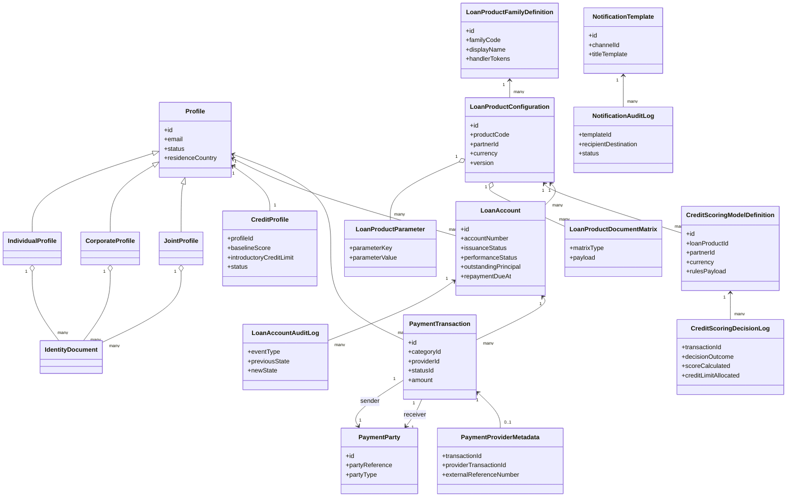
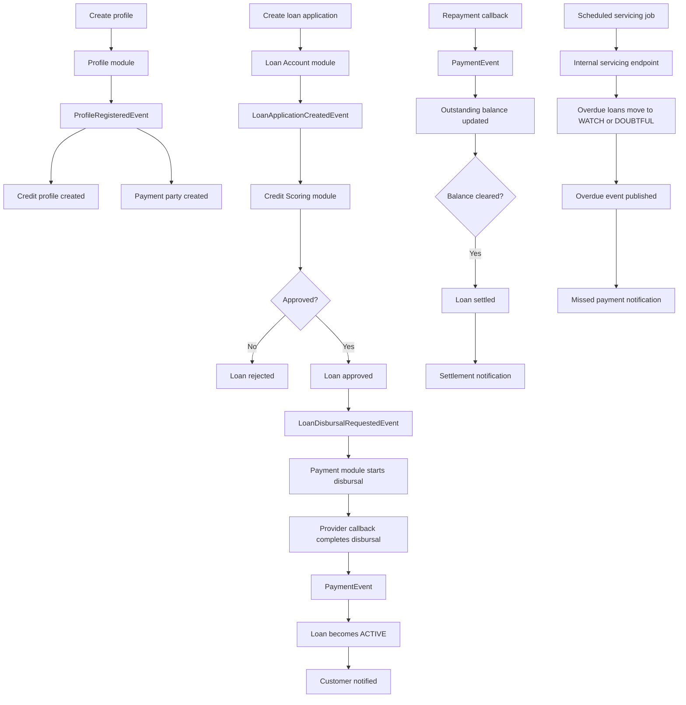
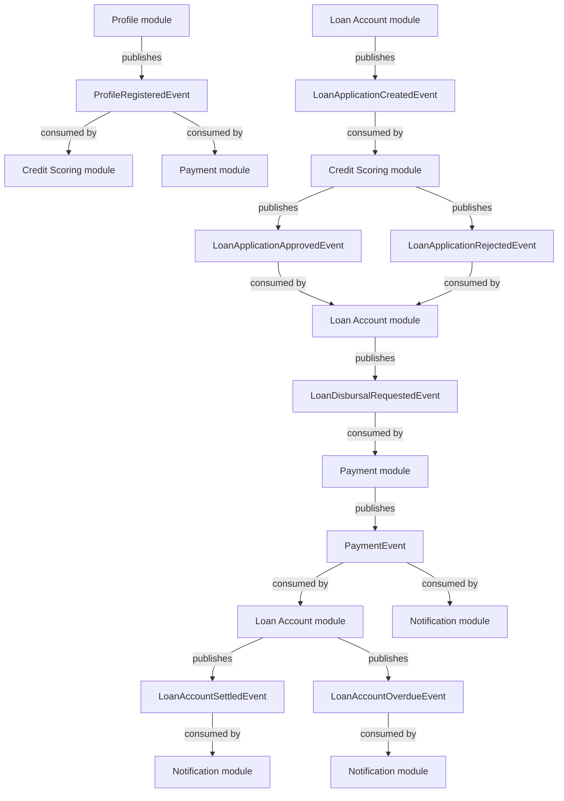

# Architecture Overview
I have built this project as a **modular monolith**: one Spring Boot application, split into clear business modules. 

Ideally a spring-boot microservice setup would be best, however, I wanted to showcase the clear separation of business domains without over-heading of setting up multiple micro-services.

## Main modules

- **Profile** - customer onboarding and profile records
- **Loan Product** - product families, product parameters, and document matrices
- **Credit Scoring** - baseline credit profile and configurable scorecards
- **Loan Account** - loan application flow, account state, servicing, and audit logs
- **Payment** - disbursal and repayment transaction handling
- **Notification** - template-based customer communication (SMS, Email, Push Notification)
- **Events** - internal domain events that connect the modules

## UML-based domain schema

I have kept the core entities separated by domain so the model is easier to extend without mixing product setup, underwriting, servicing, payments, and communication concerns.

## How the core flow works

## Event lifecycle view

This second view focuses just on which module publishes an event and which module reacts to it.

## Why I structured it this way

A lending system usually manages several domains at once: customer data, product rules, underwriting, payments, and communication.

I have separated those concerns into modules and connected them with events for practicality:
- each module has a clear job
- the main loan flow is easier to follow
- I can add some behavior by subscribing to an event instead of rewriting an existing flow
- the whole project is simple to run locally because it is one application

## Loan product configuration

I have split loan products into two layers:

1. **family definitions** - broad product families and metadata
2. **product configurations** - partner and currency specific product records with parameters

Each product can store:
- flexible key-value parameters
- JSON document or rule matrices
- active/inactive state
- audit history for configuration changes

#### About the handler tokens

Family definitions include fields like:
- `disbursementHandlerToken`
- `accrualHandlerToken`
- `repaymentHandlerToken`
- `delinquencyHandlerToken`

This is **future-facing metadata** for functionality that is not implemented in this submission.

I use them to show where product-family specific logic would plug in later, but I have not wired them to executable strategy implementations yet. In a larger production system, I would use them to route to different servicing, accrual, repayment, or delinquency handlers.

## Credit decisioning and lending limits

I have kept the lending-limit logic deliberately simple and explainable for the assignment.

The current flow is:
- each customer gets a baseline credit profile at onboarding
- products can have a configurable credit-scoring model
- the application is approved only if:
  - the profile is active
  - the baseline score is acceptable
  - the requested principal is within the approved limit
  - the new request does not push the customer above their **current aggregate outstanding exposure**

If a customer already has open exposure, I stop a new approval when the combined amount would exceed the approved limit.

### What I would add in production

For a production lending platform, I would go further with:
- **aggregate portfolio exposure** by customer and by product family
- **historical repayment behaviour** such as on-time repayment ratio, restructures, delinquencies, and defaults
- **changing limits over time** based on account age, repayment history, and review cycles
- **credit line utilization across products** rather than checking each new request mostly on its own
- stronger fraud, affordability, and policy controls

I did not build all of that here because it would add a lot of extra complexity for the assignment without improving the clarity of the core loan flow.

## Servicing and delinquency handling

I have added a basic servicing flow.

A scheduled job runs on a configurable cron expression and calls this endpoint:

- `POST /api/v1/internal/loan-accounts/servicing/run`

The loan-account module then:
- finds active loans past their simplified repayment due date
- updates `daysPastDue`
- moves the loan into `WATCH` or `DOUBTFUL`
- writes an audit log entry
- publishes an overdue event

The notification module listens for that overdue event and sends a missed-payment message using the seeded notification template.

#### What I would add in production

- installment schedules
- interest accrual posting
- promise-to-pay tracking
- collections workflows
- retry/outbox delivery guarantees
- full amortisation logic

## Notifications

I have kept notifications event-driven and template-based.

That means the core modules do not need to know how an email or SMS is sent. They publish events, and the notification module handles the communication step.

Current supported behavior:
- email delivery through Spring Mail
- SMS and push as **stubbed/logged implementations**
- audit logs for each notification attempt

#### What I would add in production

- retries and dead-letter handling
- provider failover
- outbox/event delivery guarantees
- per-channel delivery receipts
- richer template versioning or campaign tooling

For this assignment, I wanted it to clearly show the extension point without turning the project into a full communications platform.

## Authentication note

The intended production direction is **JWT-based authentication**.

JWT dependencies are present, but auth is **not implemented in this submission** because it is out of scope for this case study. In the current dev setup, requests are open so the functional loan flows are easy to review.

## Spring Modulith usage

I use a module-oriented package structure and I also added a **Spring Modulith verification test**. There is automated test checking the declared relationships between modules.

## Summary

I aimed for a practical first version of a lending platform backend:
- easy to run locally
- organized around the main lending domain areas
- event-driven where it helps the most
- intentionally simplified where a full production implementation would be much larger
